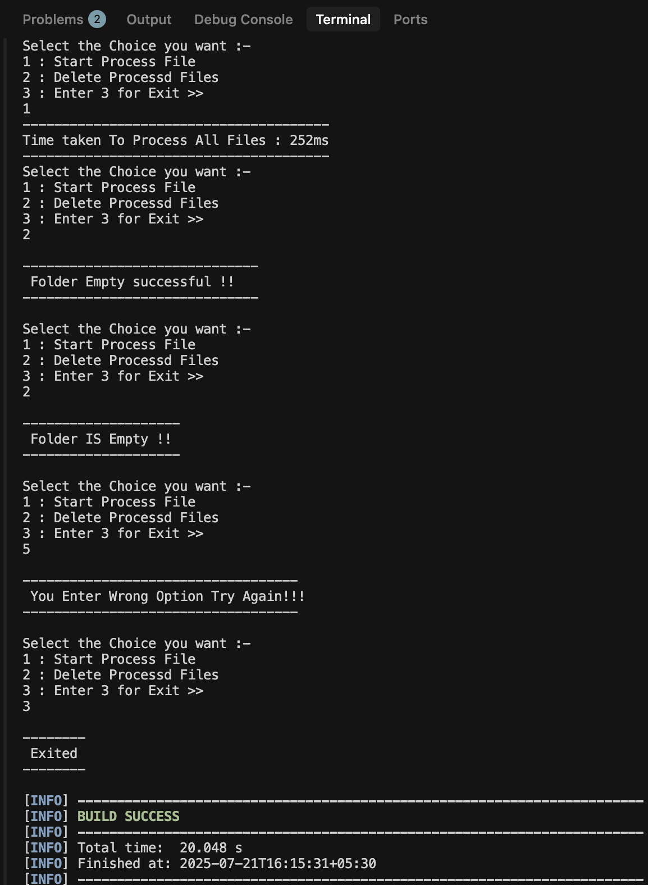

# Story Correction Engine by Aniket Jain

## Overview
Story Correction Engine is a Java-based tool that processes large text files (such as classic books) and performs word substitutions based on a user-defined mapping provided in an Excel file. It is designed to automate the correction or transformation of words in bulk text documents, making it useful for text normalization, censorship, or language adaptation tasks.

## Features
- Reads a list of word substitutions from an Excel file (`ExcelFile/Word Substitutions.xlsx`).
- Processes all `.txt` files in the `Unprocessed/` directory, applying the substitutions.
- Outputs the processed files to a `Reprocessed/` directory (created at runtime).
- Supports batch processing using multithreading for efficiency.
- Simple command-line interface for starting processing or cleaning output files.

## Project Structure
```
├── ExcelFile/
│   └── Word Substitutions.xlsx   # Excel file with word mappings
├── Unprocessed/                 # Input directory for raw text files
│   └── *.txt                    # (e.g., classic books)
├── src/
│   └── main/java/assign/headstrait/
│       ├── Main.java            # Entry point, CLI
│       └── OperationsOfWord.java# Core processing logic
├── target/                      # Maven build output (ignored)
├── .idea/, .settings/           # IDE config (ignored)
├── pom.xml                      # Maven project file
└── README.md                    # Project documentation
```

## Prerequisites
- Java 8 or higher
- Maven

## Setup & Usage
1. **Install dependencies:**
   ```sh
   mvn clean install
   ```
2. **Prepare your word mapping:**
   - Edit `ExcelFile/Word Substitutions.xlsx` to define your substitutions (column 1: original, column 2: replacement).
3. **Add input files:**
   - Place `.txt` files to be processed in the `Unprocessed/` directory.
4. **Run the program:**
   ```sh
   mvn exec:java -Dexec.mainClass="assign.headstrait.Main"
   ```
   - Follow the CLI prompts to process files or clean the output folder.
5. **Check output:**
   - Processed files will appear in the `Reprocessed/` directory.

## Cleaning Output
- Use the CLI option to delete all files in `Reprocessed/`.

## Dependencies
- [Apache POI](https://poi.apache.org/) (for reading Excel files)

## Notes
- The `Reprocessed/` directory is created at runtime if it does not exist.
- Only `.txt` files in `Unprocessed/` are processed.
- The program is multithreaded for faster processing of multiple files.

## License
This project is for educational and demonstration purposes. 

## Sample terminal output of the Story Correction Engine

